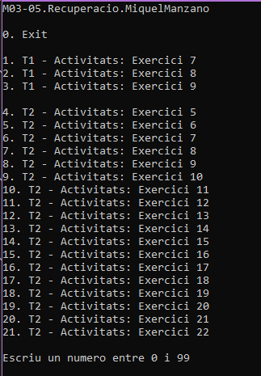

# M03-05.Recuperacio.MiquelManzano
En aquesta solució trobaràs tots els exercicis relacionats amb el dossier de recuperació.
## SetUp
Només hauràs d'executar el codi i apareixerà un menú amb tots els exercicis.

Selecciona l'exercici i s'executarà.

---

Miquel Manzano - [@miquel-manzano](https://github.com/miquel-manzano)

DAMv1